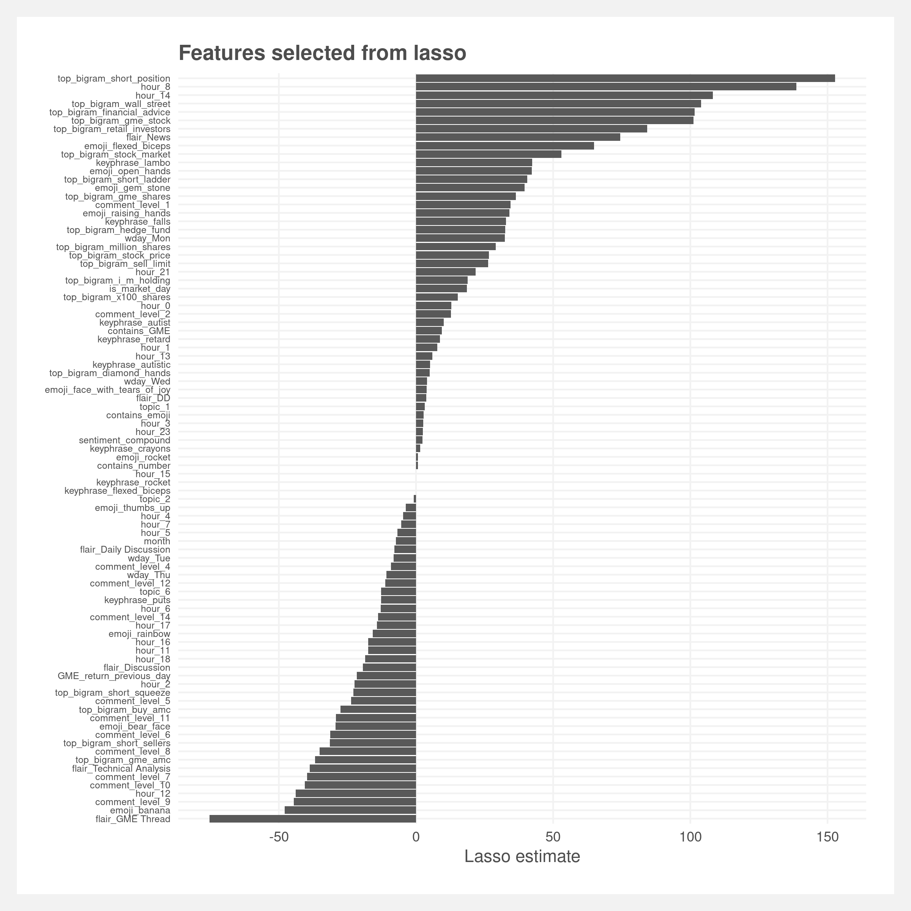
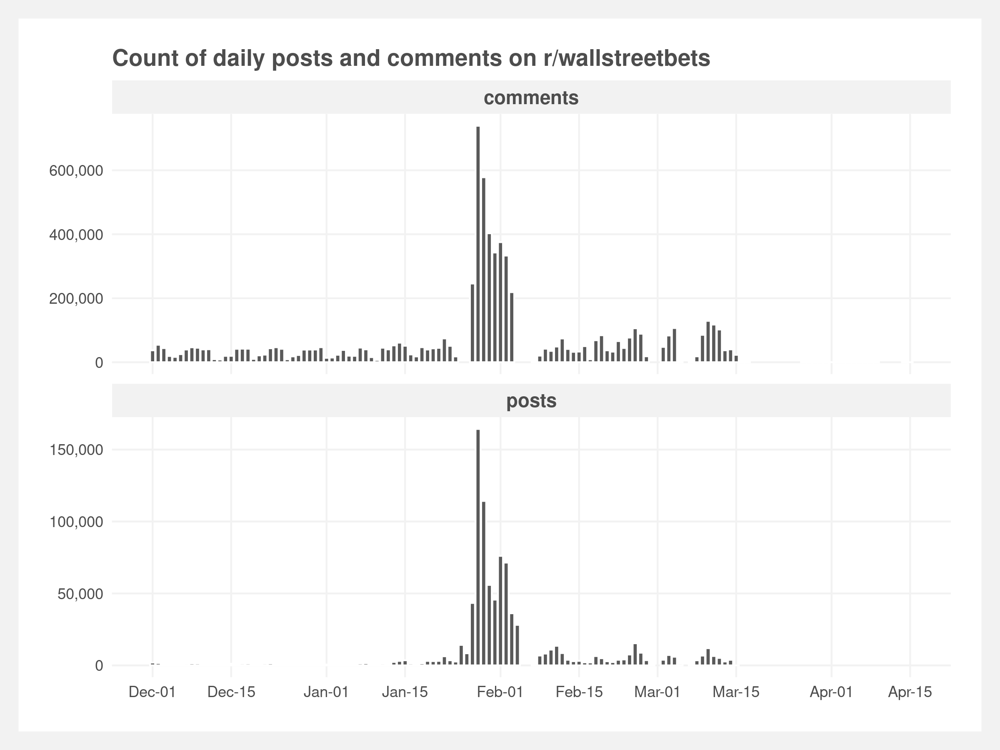

# Text analysis of r/wallstreetbets

Text analysis of the internet forum [r/wallstreetbets subreddit](https://www.reddit.com/r/wallstreetbets/) to predict the popularity of posts from the post's text.

Final project for NYU Messy Data and Machine Learning class. Contains explicit language.

 

 

## Folder structure

    .
    ├── analyses          # Model fitting, validation, and performance estimates
    │   └── plots         # Plots
    ├── data              # Cleaned data and cleaning scripts
    ├── inputs            # Raw input data and scraping scripts
    ├── material          # Class material (check-ins, final writeup, presentation)
    ├── LICENSE
    └── README.md

## Reproducibility
To reproduce, run the scripts in the following order:  
1. `inputs/scrape_WBS.R`  
2. `data/cleaning.R`  
3.  Topic modeling and sentiment  
    1. `analyses/topic_modeling.R`  
    2. `analyses/sentiment_scoring.py`  
4. `analyses/feature_engineering.R`  
5. `analyses/feature_selection.R`  
6. `analyses/create_train_test_split.R`
7. `analyses/model_upvotes.R`  
